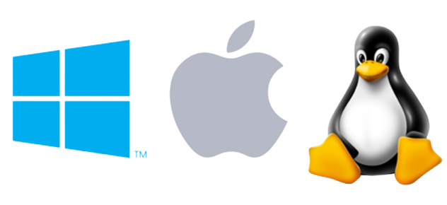

# Blogger

Create your own blog and write new articles easily with Blogger, a multiplatform desktop application. 

## About

This application allows user to create his own blog, and add his own content to it. 

It is made with C++ using Qt and Qt Quick.
Compatible with Windows, Linux and MacOS.



Features: 
* user registration and login
* user can create/edit/view/delete blog articles
* each article contains a timestamp of last modification
* data stored locally in a .json file
* resizable window size
* modern look inspired by Material Design dark

Note: this application is currently under development and is not suitable for production usage as hashing of passwords has not been implemented yet.


## Showcase

After launching the application the user is greeted with a login/registration screen.


When the user is authenticated, he can see the contents of his blog.


Layout of the interface adapts to the window size. After decreasing the width of the above window:


## Data storage

Data is retained after closing the application and is stored locally in a `data.json` file.

Example `data.json` content:

``` .json
"blogs": [
        {
            "articles": [
                {
                    "content": "Lorem ipsum lorem ipsum",
                    "modificationDateTime": "Fri Apr 8 16:51:06 2022",
                    "title": "Don't Be Tech-Driven; Be Tech-Led"
                },
                {
                    "content": "Lorem ipsum lorem ipsum",
                    "modificationDateTime": "Fri Apr 8 16:51:29 2022",
                    "title": "Three Technologies That Can Help You Mobilize And Digitize Your Supply Chains"
                },
                {
                    "content": "Lorem ipsum lorem ipsum",
                    "modificationDateTime": "Fri Apr 8 16:51:56 2022",
                    "title": "Google removes apps for secretly copying phone numbers"
                },
                {
                    "content": "Lorem ipsum lorem ipsum",
                    "modificationDateTime": "Fri Apr 8 16:52:31 2022",
                    "title": "Big banks work together to get their own ID verification service"
                },
                {
                    "content": "Lorem ipsum lorem ipsum",
                    "modificationDateTime": "Fri Apr 8 16:52:21 2022",
                    "title": "All-private Astronaut Team Set For Landmark Launch To Space Station"
                },
                {
                    "content": "Lorem ipsum lorem ipsum",
                    "modificationDateTime": "Fri Apr 8 16:53:09 2022",
                    "title": "ProtonMail buys email alias service SimpleLogin"
                },
                {
                    "content": "Lorem ipsum lorem ipsum",
                    "modificationDateTime": "Fri Apr 8 16:52:52 2022",
                    "title": "Microsoft Warns Russia Regarding Ukraine"
                },
                {
                    "content": "Lorem ipsum lorem ipsum",
                    "modificationDateTime": "Thu Apr 7 19:10:55 2022",
                    "title": "Apple brings Putin opposition app back to Russia App Store"
                },
                {
                    "content": "Lorem ipsum lorem ipsum",
                    "modificationDateTime": "Thu Apr 7 19:10:58 2022",
                    "title": "Here are the best tablet deals right now"
                }
            ],
            "blogName": "John's tech news",
            "owner": "john@gmail.com"
        },
        {
            "blogName": "Jackie",
            "owner": "jack@gmail.com"
        },
        {
            "blogName": "Mój blog",
            "owner": "zosia@gmail.com"
        },
        {
            "blogName": "Asia's blog",
            "owner": "asia@gmail.com"
        },
        {
            "blogName": "Jan's blog",
            "owner": "janek@gmail.com"
        },
        {
            "blogName": "Franciszka's blog",
            "owner": "franciszka@gmail.com"
        },
        {
            "blogName": "Adams blog",
            "owner": "adam@gmail.com"
        }
    ],
    "users": [
        {
            "email": "john@gmail.com",
            "password": "GQST4avM"
        },
        {
            "email": "jack@gmail.com",
            "password": "2pxuYqZS"
        },
        {
            "email": "zosia@gmail.com",
            "password": "P9qQQekP"
        },
        {
            "email": "asia@gmail.com",
            "password": "qoWJJYx7"
        },
        {
            "email": "janek@gmail.com",
            "password": "rDhs8RJp"
        },
        {
            "email": "franciszka@gmail.com",
            "password": "pxJWzCh3"
        },
        {
            "email": "adam@gmail.com",
            "password": "Dr4VwXfK"
        }
    ]
}
```

